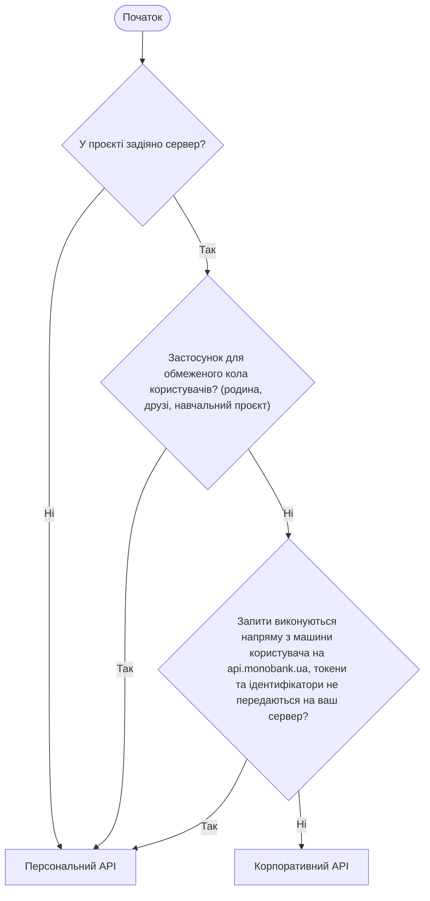

# Documentación comunitaria de la API de Monobank


La mayor parte de la información en este repositorio se refiere específicamente a la API abierta de Monobank.

Para otras APIs, consulte la información [más abajo](#інші-api-створені-командою-mono).

> La información ha sido estructurada por la comunidad de usuarios de la API de Monobank basándose en la experiencia práctica de uso o en el feedback de los representantes de Monobank en el grupo de Telegram de la comunidad (el enlace al grupo está disponible en la página de documentación de la API).

## API

Monobank Open API es una API disponible públicamente (sin autenticación), para clientes del banco mediante un token de autenticación, o para proveedores de servicios.

Esta API es una iniciativa personal de parte de los desarrolladores de Mono. Se mantiene en tiempo libre y se proporciona "tal cual".

Con "mantenido en tiempo libre" nos referimos a que los empleados de Monobank trabajan en el proyecto Open API, pero no tiene "sprints", "gestión de proyecto", "hoja de ruta", "KPIs" ni nada de lo que existe en otras áreas.
Es decir, las mejoras se realizan ya sea por iniciativa propia o por solicitudes externas (pero con una prioridad menor respecto al desarrollo de otras áreas).

Por diversas razones (incluidas las de seguridad), la Open API solo permite operaciones de tipo "Read-only".
No es posible crear transacciones ni modificar los datos del cliente.

Solo el desarrollador puede proporcionar información _absolutamente precisa y exhaustiva_ sobre esta API.

### API general (personal)

Enlace a la documentación de la API: https://api.monobank.ua/docs/ (o: https://monobank.ua/api-docs/monobank)

> Vea también la especificación OpenAPI [open_personal_api.json](specs/open_personal_api.json)
>
> Abrir en Swagger Editor: https://editor.swagger.io/?url=https://raw.githubusercontent.com/andrew-demb/monobank-api-community-docs/refs/heads/main/specs/open_personal_api.json

### API corporativo para proveedores de servicios

Enlace a la documentación de la API: https://api.monobank.ua/docs/corporate.html (o: https://monobank.ua/api-docs/providers)

El acceso "Production" a la API se otorga ÚNICAMENTE después de confirmar la solicitud enviada a través de la API: 
https://api.monobank.ua/docs/corporate.html#tag/Avtorizaciya-ta-nalashtuvannya-kompaniyi/paths/~1personal~1auth~1registration/post

> El flujo general de interacción con la API es bastante similar al de la API personal, por lo que hasta obtener la confirmación de la solicitud de uso de la API para proveedores, 
> se puede utilizar la API personal para pruebas.

Algoritmo de firma de solicitudes a la API (encabezado HTTP "X-Sign"): https://gist.github.com/Sominemo/64845669d6326f2f73d356f025656bdb#signing-the-request

> Vea también la especificación OpenAPI [open_provider_api.json](specs/open_provider_api.json)
>
> Abrir en Swagger Editor: https://editor.swagger.io/?url=https://raw.githubusercontent.com/andrew-demb/monobank-api-community-docs/refs/heads/main/specs/open_provider_api.json

#### Diagrama de flujo para determinar si necesita la API para proveedores de servicios

<details>
<summary>Показати блок-схему</summary>



> Autor: Sominemo

</details>

## Comunidad API en Telegram

Se ha creado un chat en Telegram para la comunidad de usuarios de Monobank Open API con los siguientes propósitos:
- proporcionar feedback sobre el uso de la API;
- ayuda mutua entre usuarios sobre temas de uso de la API;

Para mantener un equilibrio de información útil en el chat y ahorrar tiempo a los demás participantes, se considera buena práctica:
- no usar el chat como bolsa de trabajo freelance;
- no usar el chat como "club de programadores";
- discutir temas relacionados específicamente con el uso de Monobank Open API;
- respetar el tiempo de los demás y familiarizarse con la información proporcionada aquí, en los mensajes fijados del chat y en la documentación.

> El enlace al chat está disponible en la página de documentación de la API.

## Características no documentadas de la API

### 1. Límite máximo de pagos devueltos en una sola solicitud a la API

El endpoint del estado de cuenta de transacciones ([docs](https://api.monobank.ua/docs/#tag/Kliyentski-personalni-dani/paths/~1personal~1statement~1{account}~1{from}~1{to}/get)) devuelve como máximo 500 transacciones ordenadas desde el final del período 
(es decir, desde el momento `to` hasta `from`) en una sola llamada.

> La posible razón para esta limitación en el número de resultados y la ausencia de herramientas de paginación con offset es: https://use-the-index-luke.com/sql/partial-results/fetch-next-page

Recomendaciones:
- Si el número de transacciones es 500, es necesario realizar una solicitud adicional modificando (reduciendo) el tiempo `to` hasta el momento del último pago de la respuesta.
- Si nuevamente el número de transacciones es 500, continúe realizando solicitudes hasta que el número de transacciones sea < 500.
- Por lo tanto, si el número de transacciones es < 500, se han obtenido con éxito todos los pagos del período especificado.

## Preguntas frecuentes

### 1. ¿Cómo obtener la especificación OpenAPI de la API?

Al contar con la especificación OpenAPI (https://www.openapis.org/), puede utilizar un generador de código para su lenguaje de programación,
rastrear los cambios en la API comparando el esquema que utilizó (y guardó) "hace un mes" con el actual, etc.

> **Nota**: debido a la ausencia de changelogs de la API, como experimento, los mantenedores de la documentación comunitaria
> sincronizan de vez en cuando (manualmente) la especificación OpenAPI en el directorio [specs](specs/).
> Por ejemplo: [specs/open_personal_api.json](specs/open_personal_api.json)

Aunque la documentación de Monobank no proporciona un método explícito para descargar la especificación OpenAPI, técnicamente es posible obtenerla.

Para OpenAPI, esto consiste en abrir la documentación en el navegador y ejecutar el siguiente código JS en la consola:
```js
const openApiSchema = __redoc_state.spec.data;
const jsonSchema = JSON.stringify(openApiSchema, null, 2);
console.log(jsonSchema);
```

Como resultado, se imprimirá en la consola una cadena JSON con la especificación OpenAPI, que puede copiar en un archivo, en el editor en línea https://editor.swagger.io, etc.

> Para otras APIs, la información sobre cómo obtener la especificación OpenAPI se detalla en las secciones relevantes más abajo.

### 2. ¿Es posible obtener las etiquetas creadas por el usuario para los pagos del estado de cuenta?

No. Se desconoce cuándo estará disponible.

## Solución de problemas

### 1. Error al llamar a la API - código de estado 403 con HTML en el cuerpo de la respuesta o "glory to Ukraine! glory to the heroes!"

Si al trabajar con la API recibe un error 403, es muy probable que AWS 
(que "protege" la API contra ataques maliciosos) lo haya bloqueado.

Lamentablemente, ni los desarrolladores (representantes del banco) ni la comunidad pueden ayudar a desbloquearlo.

Por lo general, los bloqueos se producen por una actividad excesiva desde la dirección IP del remitente
y duran un intervalo de 24 horas.

Se recomienda verificar que la frecuencia de uso de la API cumpla con las recomendaciones proporcionadas en la documentación y utilizar una dirección IP "blanca" para su sistema.

> Consejo pro: si necesita estados de cuenta, considere la posibilidad de usar WebHooks para guardar la información de los pagos en la base de datos de su sistema.

El cuerpo de la respuesta puede verse así:
```
 <html>
    <head>
      <title>403 Forbidden</title>
    </head>
    
    <body>
      <center>
        <h1>403 Forbidden</h1>
      </center>
    </body>
</html>
```

o así:
```
glory to Ukraine!
glory to the heroes!
```

## Otras APIs creadas por el equipo de mono 

Monobank no solo tiene una API abierta, sino también otras:
1. Adquirencia online (Internet acquiring)
2. Compra a plazos
3. Expirenza by mono (shaketopay)
4. API para gestionar cuentas de empresas
5. Open Banking
6. mono checkout (obsoleto)

También puede ver la lista de servicios API con acceso rápido a la documentación de los servicios mencionados en esta dirección: https://monobank.ua/api-docs

Para estos servicios, los empleados de Monobank pueden brindarle asesoramiento. Puede contactarlos a través de los canales de comunicación proporcionados en las páginas de aterrizaje (landing pages) de los servicios.

### 1. Adquirencia online (acquiring)

Enlace a la landing page del servicio "Plata by mono": https://monobank.ua/plata-by-mono

Enlace a la documentación de la API: https://api.monobank.ua/docs/acquiring.html (o https://monobank.ua/api-docs/acquiring)

#### Integraciones conocidas

Monobank proporciona información sobre las integraciones existentes (tanto las oficiales, que son soportadas por empleados de Monobank, como las desarrolladas por sus socios) - https://monobank.ua/plata-by-mono/integrations

En el enlace anterior también puede encontrar instrucciones para instalar integraciones en plataformas conocidas (CMS, constructores de sitios web, chatbots, etc.).

#### Especificación OpenAPI

> Vea también [acquiring.json](specs/acquiring.json)
>
> Abrir en Swagger Editor: https://editor.swagger.io/?url=https://raw.githubusercontent.com/andrew-demb/monobank-api-community-docs/refs/heads/main/specs/acquiring.json

De manera similar al método para obtener la especificación de la Monobank open API (vea las FAQ arriba).

### 2. Compra a plazos

Enlace a la landing page del servicio: https://monobank.ua/chast/vendors

Enlace a la documentación de la API: https://u2-demo-ext.mono.st4g3.com/docs/index.html (o https://monobank.ua/api-docs/chast)

#### Especificación OpenAPI

> Vea también [chast.json](specs/chast.json)
>
> Abrir en Swagger Editor: https://editor.swagger.io/?url=https://raw.githubusercontent.com/andrew-demb/monobank-api-community-docs/refs/heads/main/specs/chast.json

Al momento de escribir esta sección, al abrir la documentación y revisar la consola del navegador (Network), se realizaba una solicitud a `https://u2-demo-ext.mono.st4g3.com/v2/api-docs`, desde donde se devolvía la especificación OpenAPI.

Obtener mediante `curl`:
```bash
curl 'https://u2-demo-ext.mono.st4g3.com/v2/api-docs' -H 'accept: application/json'
```

### 3. Expirenza by mono (shaketopay)

Enlace a la landing page del servicio: https://shaketopay.com.ua

Enlace a la documentación de la API: https://docs.expirenza.com/api

No se puede proporcionar la especificación OpenAPI, ya que toda la interacción se realiza a través de WebSocket.

### 4. API para gestionar cuentas de empresas

Enlace a la documentación de la API: https://corp-api.monobank.ua

La especificación OpenAPI está disponible para descarga desde la interfaz de usuario y no se rastrea en este repositorio.

### 5. Open Banking

Qué es: https://bank.gov.ua/ua/payments/open-banking

Enlace a la documentación de la API: https://ob.mono.bank

La especificación OpenAPI está disponible para descarga desde la interfaz de usuario y no se rastrea en este repositorio.

### 6. mono checkout (obsoleto)

**IMPORTANTE**: este servicio actualmente no está disponible para nuevos clientes y se encuentra en proceso de cierre.

> Enlace a la landing page del servicio "mono checkout": https://checkout.mono.bank
> 
> El enlace a la documentación de la API se debe buscar en la página de aterrizaje (al momento de escribir este texto, era un enlace a Google Docs).
> 
> Existe una documentación "especial" e independiente sobre la verificación del callback del banco en cuanto a "confiabilidad" - https://docs.google.com/document/d/1t6UZhPn3UHHBmD1BJn22Z9bk5YGzVvUWwa-lnrv6Lj0/view. 
> Mientras este enlace a dicha parte de la documentación no esté presente en la documentación principal del servicio, el enlace permanecerá aquí.
